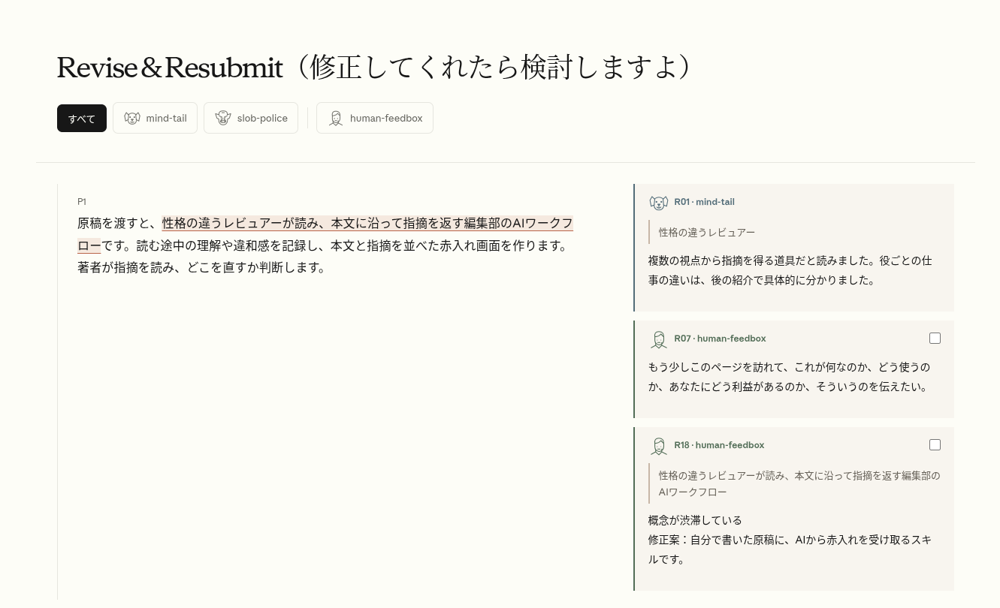
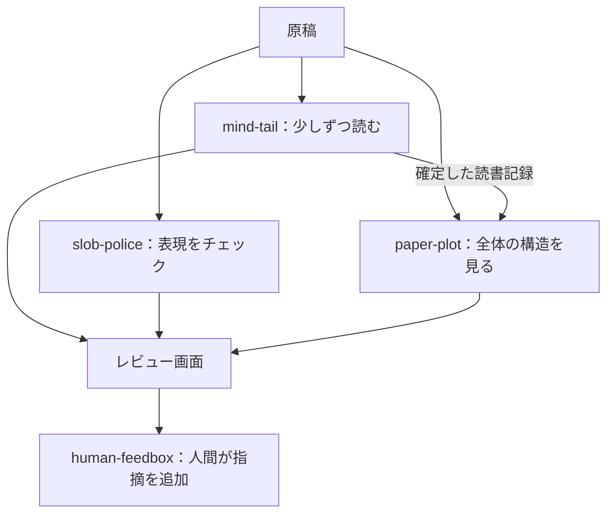

# Revise & Resubmit（修正してくれたら検討しますよ）

原稿を渡すと、様々な観点でレビューを行い、指摘をする編集部的なマルチエージェントスキルです。

スキルを実行すると、各エージェントがレビューを進めるのでしばらく待ちます。完了したらレポートがWebアプリとして開かれるので、ブラウザで見ます。自分もレビューに参加して指摘を追加できます。

集まった指摘をもとに、原稿は自分で直し、校正を繰り返します。AIは原稿の本文を一切編集しません。



左が原稿、右が指摘です。このREADMEをレビューしたときの画面です。

---

## 使い方

1. インストール  
   Python 3、Node.js/npm、Claude Code / Codexを用意します。原稿を置くプロジェクトのルートで、使う環境のコマンドを実行します。

   Claude Code：
   ```sh
   npx skills add laiso/revise-and-resubmit --skill revise-and-resubmit --agent claude-code
   ```
   Codex：
   ```sh
   npx skills add laiso/revise-and-resubmit --skill revise-and-resubmit --agent codex
   ```
   スキルはプロジェクト内にインストールされます。詳しくは[導入手順](docs/install.md)を参照してください。
2. 原稿を渡す  
   マークダウンファイルを指定して実行します。次のように呼び出します。
   ```text
   /revise-and-resubmit 原稿.md
   ```
3. 赤入れを見る  
   レビューが終わったら、ブラウザで本文と指摘事項を読みます。
4. 自分も赤入れする  
   本文を選択して指摘を入力し、「保存」を押します。
5. 原稿を直す  
   必要だと思った箇所を自分で修正します。改稿後は再レビューを依頼できます。

## なぜ作ったか

今、世間一般で行われている、AIが生成した文章を脱臭スキルでこねくり回すアプローチは、それほど有効ではないと思っています。一方、個人的な体験として、書籍執筆の仕事で編集部とやり取りをして、編集という仕事の力を実感しました。

その経験から、編集部の力を少しでもAIで再現しようと作っているのが、「Revise & Resubmit（修正してくれたら検討しますよ）」です。

このスキルではサブエージェントのコンテキストを分けて、理解の過程、全体の構造、細部の表現をそれぞれ違う視点からレビューします。そこに人間のバイアスやノイズも含めた指摘が加わることで、レビューのスパイスになります。集まった指摘をもとに文章を変えるのは、あくまで書き手です。

## サブエージェント



-  [mind-tail](skills/revise-and-resubmit/references/personas.md)  
  少しずつ原稿を読みながら理解していく役です。その時点で分かったこと、分からないこと、自分で補ったことを記録し、後の説明で理解が変わる過程も追います。
-  [paper-plot](skills/revise-and-resubmit/references/structure-review.md)  
  トップダウンで文章全体を見渡し、段落の役割やつながりを図にする役です。mind-tailの記録が確定してから、少しずつ読んで積み上げた理解と、全体から見た構造を照らし合わせます。
-  [slob-police](skills/revise-and-resubmit/references/slob-police.md)  
  細部の言い回しをかなり厳しくチェックし、気に入らない表現を探す役です。直訳調の表現、場にそぐわない語彙、内容の薄い長文や繰り返しを嫌い、一箇所でも許せないと不満を述べて読むのをやめます。
-  [human-feedbox](skills/revise-and-resubmit/references/human-feedbox.md)  
  [それはあなたです!](https://dic.pixiv.net/a/%E3%81%9D%E3%82%8C%E3%81%AF%E3%81%82%E3%81%AA%E3%81%9F%E3%81%A7%E3%81%99%21)　ブラウザで赤入れし、人間の指摘もサブエージェントの反応と同列に記録します。

### 謝辞・参考元

- [First Reader](https://github.com/Shubhamsaboo/awesome-llm-apps/tree/main/agent_skills/first-reader)（Shubhamsaboo / awesome-llm-apps）：文章を少しずつ読ませ、その時点でどう理解したかを聞いて記録する手順が、ワークフロー設計のヒントになりました。
- [cognitive-rhythm-writing](https://gist.github.com/k16shikano/eb2929f13ed19c97188393d297be8432)（k16shikano）：理解の足場や説明の流れを追うための観点を参考にしました。
- [japanese-tech-writing](https://gist.github.com/k16shikano/fd287c3133457c4fd8f5601d34aa817d)（k16shikano）：状況の把握や用語の指示対象を確かめる観点を参考にしました。

スキルの定義やコードは、主にCodex/GPT-6 Atlasが執筆・実装しました。著者が原稿とレビューを読み、役割や挙動、画面への指摘を返しながら作っています。

このREADMEも、著者のメモをもとにAIが起草し、会話で構成や表現を検討しています。
